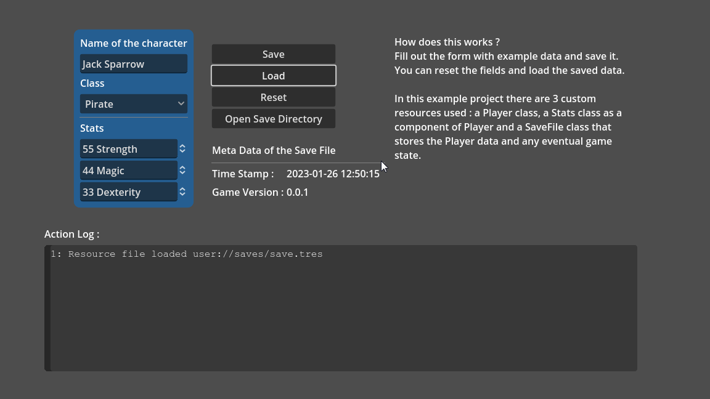

# Godot 4 Custom Resources demo
## This is a demo project to save and load data using [custom resources](https://docs.godotengine.org/en/latest/tutorials/scripting/resources.html)

This simple project showcases how to use custom resources to store your data and save it in a resource file.
Custom Resources can be used as a viable alternative to other storage formats.

It consists of 3 custom resource classes, the Player class, the Stats class that used as a component of the Player class
and the SaveFile class that serves as a resource to store the Player data and eventually any game state that needs to be persistent.  
It shows how easy it is to nest all data and save it locally with the use of Godot's internal [ResourceSaver](https://docs.godotengine.org/en/latest/classes/class_resourcesaver.html) and [ResourceLoader](https://docs.godotengine.org/en/latest/classes/class_resourceloader.html) objects.

The save file is located in the `user://saves` folder and the save file name used is `save.tres`.

[Licensed under MIT](./LICENSE)
